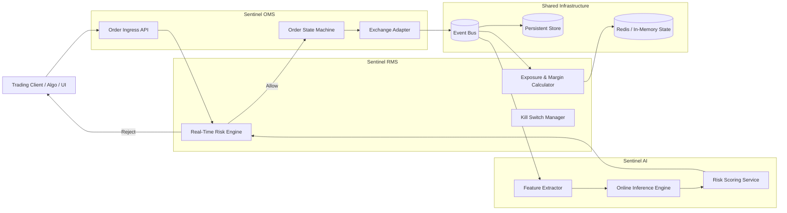

# Sentinel  
## Modular Order and Risk Intelligence Platform for Financial Trading

## 1. Overview

**Sentinel** is a modular, enterprise-grade trading platform designed to support brokerage firms, proprietary trading desks, and exchange adjacent systems.  
The platform is composed of three independent but tightly integrated products:

1. **Sentinel OMS** – Order Management System  
2. **Sentinel RMS** – Risk Management System  
3. **Sentinel AI** – Machine Learning based Trading Risk & Intelligence System  

Each product can be deployed independently or together, enabling flexible adoption while maintaining first class integration and consistent data models.

## 2. Problem Statement

Current trading platforms in the Indian and emerging markets ecosystem are predominantly:

- Monolithic
- Closed source
- Difficult to customize
- Slow to adopt advanced analytics and machine learning

Regulatory pressure, increasing retail participation, and complex trading strategies have created demand for:

- Real time risk enforcement
- Post trade supervision
- Predictive risk intelligence
- Modular, API-driven systems

Sentinel addresses these gaps with a composable architecture and explicit separation of responsibilities.

## 3. Product Architecture

### High-Level Components

- OMS handles order lifecycle and exchange connectivity
- RMS enforces deterministic, rule-based risk controls
- AI system provides probabilistic and predictive intelligence

## 4. Sentinel OMS (Order Management System)

### Responsibilities

- Order lifecycle management
- Exchange abstraction and connectivity
- Order state transitions
- Audit and compliance logging

### Key Features

- Support for standard order types (Market, Limit, Stop-Loss)
- Deterministic order state machine
- Partial fills, cancellations, rejections
- Exchange-agnostic internal model
- Event-driven architecture

### Explicit Non-Goals

- No embedded risk logic
- No machine learning components
- No exposure or margin calculations

## 5. Sentinel RMS (Risk Management System)

### Responsibilities

- Pre-trade risk validation
- Intraday exposure tracking
- Post-trade risk analytics
- Enforcement actions

### Risk Controls

- Margin availability checks
- Position and exposure limits
- Order size and velocity checks
- Price band validation
- Firm-level and trader-level kill switches

### Execution Model

- **Synchronous** checks for pre-trade enforcement
- **Asynchronous** evaluation for monitoring and analytics
- Deterministic outcomes with auditable decision trails

## 6. Sentinel AI (Trading Intelligence Platform)

### Product Positioning

Sentinel AI is a standalone, first-class product.  
It does not replace RMS rules; it augments them with predictive and behavioral intelligence.

### Primary Use Cases

- Identification of high-risk traders
- Fraud and manipulation detection
- Abnormal trading behavior detection
- Probability estimation of margin breaches
- Dynamic trader risk scoring

## 7. Machine Learning Architecture

### 7.1 Just-In-Time Prediction (Online Inference)

**Purpose:**  
Provide low-latency risk intelligence during live market operations.

**Trigger Events:**
- New order submission
- Rapid exposure changes
- Abnormal order modification or cancellation patterns

**Inputs:**
- Recent trading activity (sliding time window)
- Current margin utilization
- Instrument volatility metrics
- Historical trader behavior features

**Outputs:**
- Continuous risk score
- Action recommendation (Allow / Warn / Throttle / Block)

**Constraints:**
- Sub-10ms inference latency
- Non-blocking fallback to deterministic RMS rules

### 7.2 After-Market Learning (Offline Training)

**Purpose:**  
Continuously improve models using recent trading data.

**Execution Window:**
- Post-market hours (daily / weekly)

**Learning Methods:**
- Supervised learning using known risk events
- Semi-supervised anomaly detection
- Feature drift and model performance monitoring

**Deployment Strategy:**
- Shadow model evaluation
- Canary deployment
- Manual promotion with auditability

## 8. Technology Stack

### Core Systems (OMS & RMS)

- **Language:** Java 17+
- **Framework:** Quarkus or Spring Boot
- **Messaging:** Apache Kafka
- **Datastores:**
  - PostgreSQL (orders, ledger, audit)
  - Redis (real-time risk state)
- **Time-Series Storage:** ClickHouse or TimescaleDB

### AI Platform

- **Training:** Python (XGBoost / PyTorch)
- **Inference:** gRPC-based microservice
- **Model Format:** ONNX
- **Feature Storage:** Redis (online), Parquet (offline)
- **Workflow Orchestration:** Airflow or Dagster

### Infrastructure

- Docker
- Kubernetes
- Prometheus & Grafana
- GitOps-based deployment

## 9. Development Roadmap

### Phase 1 – Financial Foundations
- Double-entry ledger
- Cash and position accounting
- P&L computation

### Phase 2 – OMS Core
- Order state machine
- Exchange simulation
- Event-driven processing

### Phase 3 – RMS Core
- Rule-based pre-trade checks
- Exposure computation
- Kill-switch enforcement

### Phase 4 – OMS–RMS Integration
- Inline risk gating
- Timeout-safe execution paths
- Failure isolation

### Phase 5 – AI (Offline Analytics)
- Post-trade risk scoring
- Trader behavior clustering
- Anomaly detection

### Phase 6 – AI (Online Inference)
- Real-time scoring
- Shadow deployments
- Drift detection

### Phase 7 – Compliance & Reporting
- Full audit trails
- Regulatory-style reports
- Explainability of risk decisions

## 10. Competitive Positioning

| Dimension | Existing Platforms | Sentinel |
|--------|-------------------|----------|
| Architecture | Monolithic | Modular |
| Extensibility | Limited | API-first |
| AI Capabilities | Minimal | Core product |
| Customization | Vendor-driven | Customer-driven |
| Innovation Speed | Slow | Fast |

## 11. Target Market Segments

- Retail brokerages
- Proprietary trading firms
- Algorithmic trading desks
- Portfolio Management Services (PMS)
- Alternative Investment Funds (AIFs)
- Clearing members and sub-brokers

## 12. Project Objective

Sentinel is intended to demonstrate:

- Low-latency distributed system design
- Financial correctness and auditability
- Real-time risk enforcement
- Production-grade machine learning systems
- Regulatory-aligned architecture

## 14. Disclaimer

This project is for educational and architectural exploration purposes and does not constitute a production trading or regulatory-compliant system without further validation.